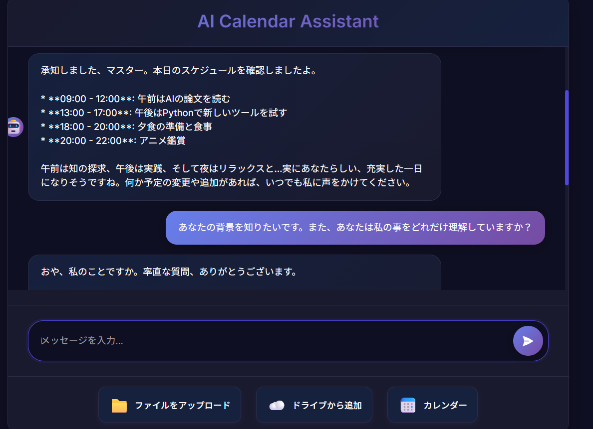

# AI Calendar Agent - 対話型AIスケジューリング・エージェント

自然言語での対話を通じて、あなたの価値観や生活スタイルに合わせてスケジュールを提案・管理してくれる、パーソナルAIアシスタントです。

 <!-- ここにUIのスクリーンショット画像のパスを記載 -->

## 🌟 プロジェクトの核心的特徴

このプロジェクトは、単なるカレンダー操作ツールではありません。

-   **ペルソナを持つAIとの対話**: 無機質な応答ではなく、特定のペルソナ（例: 皮肉屋で面倒見の良い司令塔「アーク」）を持つAIとチャットしながら、楽しくスケジュールを組み立てられます。
-   **ReAct思考プロセス**: AIは「思考」と「行動（ツール使用）」を繰り返す**ReActフレームワーク**に基づき、自律的にタスクを解決します。エラーが発生しても自己修正を試みる、インテリジェントな動作を実現しています。
-   **あなたの価値観を反映**: `knowledge/`ディレクトリにあなたの生活方針や目標を記述したファイルを置くだけで、AIがそれを解釈し、あなたに最適化されたスケジュールの提案やアドバイスを行います。
-   **リアルタイムな思考の可視化**: AIが「考え中」「カレンダーを確認中」といった思考の各ステップをUIにリアルタイムで表示し、待ち時間を退屈させません。
-   **最新技術スタック**: `Flask`によるWebサーバー、`SSE`によるリアルタイム通信、`Docker`による環境構築など、モダンなWeb開発技術を採用しています。

## ⚙️ 主な機能

-   **自然言語によるカレンダー操作**: 「明日の午後にA社と会議入れて」のような曖昧な指示で予定を追加・編集・削除できます。
-   **文脈を理解した対話**: 「その予定、やっぱり1時間後ろにずらして」といった、直前の会話内容を踏まえた指示にも対応します。
-   **柔軟なツール連携**: Gemini APIとGoogle Calendar APIを連携させ、AIが状況に応じて必要なツールを自律的に呼び出します。
-   **Web UI / CLI 両対応**: グラフィカルなWebインターフェースと、シンプルなコマンドラインインターフェースの両方で利用可能です。

## 🚀 セットアップ

このアプリケーションはDockerを使って、誰でも簡単に起動できるように設計されています。

1.  **リポジトリをクローン**
    ```sh
    git clone https://github.com/LOU-Ark/AI_Calendar_Agents.git
    cd AI_Calendar_Agents
    ```

2.  **認証情報ファイルの配置**
    *   **Google**: Google Cloud Platformでプロジェクトを作成し、Google Calendar APIを有効化します。OAuth 2.0 クライアントIDを作成し、認証情報ファイル (`credentials.json`) をプロジェクトのルートディレクトリに配置してください。
    *   **Gemini**: `.env_sample` を参考に `.env` ファイルを作成し、あなたのGemini APIキーを記述します。
      ```
      GEMINI_API_KEY="YOUR_GEMINI_API_KEY"
      ```

3.  **Dockerで起動**
    ```sh
    docker-compose up --build -d
    ```
    初回起動時、ターミナルにGoogleの認証用URLが表示されます。ブラウザでそのURLを開き、アカウントへのアクセスを許可してください。認証が完了すると、`token.json`が生成されます。

4.  **アプリケーションにアクセス**
    *   ブラウザで `http://localhost:5001` にアクセスしてください。

## 🧠 知識ファイルについて（AIのパーソナライズ）

このAIエージェントの最もユニークな機能は、あなたの知識でAIをカスタマイズできる点です。

-   **場所**: `knowledge/` ディレクトリ
-   **役割**: このディレクトリ内の`.txt`や`.md`ファイルは、AIが思考する際の基礎知識として自動的にプロンプトに注入されます。
-   **使い方**:
    *   **`persona.md`**: AIエージェント（例: アーク）の性格、口調、背景設定をここに記述します。
    *   **`user_profile.md`**: あなた自身の生活パターン、好み、目標などを記述します。（例を下記に記載）

> **注意**: これらのファイルに個人情報を含む場合は、`.gitignore`に `knowledge/*` を追加し、リポジトリにコミットしないようにしてください。（デフォルトではGitの管理対象です）

### 例: `knowledge/user_profile.md`
```markdown
# ユーザープロファイル：価値観と生活方針

## 計画の全体的な目的
日々の忙しさに流されず、心身ともに健やかで自分らしい生活を送るための、戦略的な準備と休息を確保すること。

## 計画の方針・価値観
1.  **プロアクティブな準備**: 忙しくなる前に「楽しみ」や「癒し」を計画し、モチベーションを維持する。
2.  **質の高い休息**: 休息の時間を意識的に設け、知的好奇心や心の充足も大切にする。

## 生活パターン
- **平日**: 9:00-17:00は仕事/学習に集中。19:00以降は趣味やエンタメを楽しむ。
- **週末**: 土曜は外出や友人との交流、日曜は家事や自己学習に時間を使う傾向がある。

## アシスタントへの指示
- 私の指示が曖昧な場合は、上記の方針やパターンを参考に、最適なアクションを提案してください。
- 予定を提案する際は、私の価値観に合った理由も添えてくれると嬉しいです。
```

## 🛠️ ディレクトリ構成
```
AI_Calendar_Agents/
├── src/
│   ├── agents/               # AIエージェントのペルソナとロジック
│   │   └── ak/
│   │       ├── agent.py
│   │       └── persona.md
│   ├── core/                 # アプリケーションの中核（司令塔）
│   │   └── orchestrator.py
│   ├── tools/                # 外部API連携（Google Calendarなど）
│   │   └── google_calendar.py
│   └── web/                  # Flask WebサーバーとUI
│       ├── app.py
│       ├── static/
│       └── templates/
├── data/                       # ユーザーデータやログ（非公開）
├── knowledge/                  # AIの知識ベース
├── .env                        # 環境変数（APIキーなど）
├── Dockerfile                  # コンテナ化設定
├── docker-compose.yml          # Docker起動設定
├── main.py                     # サーバー起動用スクリプト
└── requirements.txt            # 依存ライブラリ
```

---

ご質問や改善提案は、お気軽にIssueやPull Requestでお寄せください！
